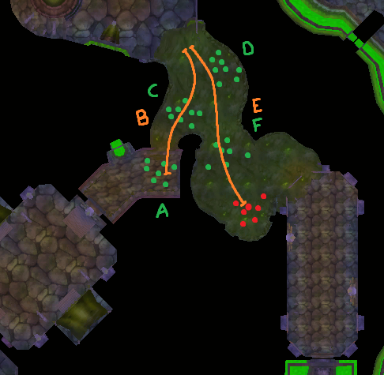

# Bouk's Naxx Pulls

This isn't a guide and is provided as is.

# Spider Wing

**a.** Pull skitterers as orange skitterer pack pats into them from Anub's doorway (towards C).  Warriors challenging + LIP here, we stack this pack since damage does not scale will pull size when challenging + LIPing.

**b.** Raid moves onto Venomstalker pack.  Hunters stay out to bait charges.  Don't worry about rushing to pull...

**c.** Repeat raid moving onto Venomstalker pack.

Kill Anub'rekan.

**d.** Pull skitterers onto raid before raid gets into LoS of the gate.  The skitterer pack in the next room can pull through the gate and chain another pack in that room.

**a or b.** Pull patting skitterers (A) asap, even if your raid is still clearing the last skitterer pack if it is safe to do so.  If they are far and it is safe, pull pack B and have a tank pickup the cleaving add asap.  Ideally, you get skitterers first and the raid can run onto pack b.

Pretty much pull anything when your raid can handle it.  The two pats B and E are venomstalkers-- have the raid move onto them and hunters stay out to bait.  You do not need to kill the red skitterer pack-- they will despawn after you kill Faerlina.  You may not even need to kill pack F.

The safest way to pull this room is to pull pack A, then B back into the tunnel and then pull the patting skitterers.  I will occasionally pull pack A and then get the patting skitterers (orange) but I've seen too many people fuck it up and end up social aggroing pack B or C.  If you want to risk it, hit the leading skitterer with a shot when it is equidistant from both packs and then hit the core pack a moment later when it is equidistant; because the pack is so spread, the rest of the skitterers do not social aggro when you hit either the leading one or the trailing group and there is a delay before they chain where the unhit group continues to travel.

After that just clear the packs.  It can help slower raids to put up a DBM timer and have ranged units precast on a single mob.

Nothing special here.  Your raid can just run on A, pull skitterer pat B when it won't chain, then raid runs on C.

The adds in this part of the wing that do not share a model are not in families with eachother.  You can pull them fairly close to one another and be safe as long as they arn't social aggro close.

**a.** Take ghoul pat back over the bridge.

**b.** Take shade-- its fairly hard to chain this with the red ghoul pat.  Shades have a massive aggro range and stealth detection.  Make sure a tank is ready to turn this away from the raid.

**c.** Every wings outer hallway has 1-2 pats.  This wing has Venomstalkers.  If you see them at any point, let them approach a pullable spot and pull them back somewhere overly safe.  Have the raid stack and hunters bait the charge.

**d.** Acolytes are best pulled by LoSing them near the walls they guard.

**e.** There are two gargoyle pats of 2 mobs each.  You only need to kill 1 pack of each section to meet speedrun requirements.  Either pull back to where you LoS'd the acolytes or run along the slime on the west to the top and pull there.  If you're not confident you can pull (these are in the same family and will aggro from far away) then wait.  Better to be overly safe here.  They have stealth detection, do not attempt to distact.

**f.** Rinse and repeat here, LoS acolytes

**g.** Run around the jutting wall where the acolytes were, hugging the left, and pull ghouls away from the shade.

**h.** Pull shade before you move.

**i.** Run around the jutting wall as a raid to facepull and move away from the skippable ghoul pack.  Check for patting venomstalkers first.

# Plague Wing

**a and b.** Pull the ghoul + slime pack regardless of the initial gargoyle pat.  They are boneless and do not do the poison volley.

**c.** Pull this around the corner as the raid finishes slimes in the first group.

**d.** In the best case scenario you catch this pat at the top of the stairs and safely pull it.  It has a deceptively long social aggro radius with E, so don't fuck up.  

**e, f, and g.** Pull these at the pace of the raid leader.  Our tanks just run into them and then back up a little.

Congrats, you're done with plague wing trash.

# Intermission

Healers will have Loatheb healing debuff here.  Our raid clears the initial 2-3 packs of DK wing during this time since they don't do much damage.

Pull a and b in any order without pulling the patting necro pack.  A wide peek here keeps you the farthest away from facepulling anything.  The raid needs to burn the Deathknights or risk being feared.  After that, pull the double Captain pack marked C.  Then head towards Abom wing.

# Abomination Wing (Abom, Construct)

Deal with the slimes that Grobb places into the middle of the room whenever.

**a.** Tanks FAP and facepull these.  Bolt once or twice and move to start pulling the pats in the next room.

**b.** There are two Bile Retchers patting around the orange path in opposite direction.  Pull these whenever you have the chance.  They seem to have a small aggro radius with the side packs.

**c.** Raid runs onto this pack to reduce time until its knocks up.

**d.** If you can catch the patting Retcher here, pull it in the doorway.  It will clean up the next skip.

This skip sucks.  Regardless of whether you got the Retcher labelled D above, you can attempt to skip the 4 abom pack.  A tank needs to be ready to pick up any chained trash.  Turn on track undead and make sure that if there is a Sludge Belcher in the next room, they are around the 11 oclock position.  If they are not, you risk chaining the four pack to your right.  Either hug the corner and tag a slime or volley such that it just tags a slime (crimson on diagram).  Return to your raid in the south corner of the room.

If the Sludge Belcher is in a shitty position, it is faster and far safer to clear the four pack to your right first.

Pull any nearby pats and the 4 pack before your raid crosses.  Call for the raid to kill the stationary Monstrosity packs when you can't get any pats, pull pats whenever convenient.  I have no strict order here, the pats are too unpredictable but you can save a ton of time if you ignore the groups and are constantly looking to pull.  Just vibe here.  

**a.** Raid runs onto these.  Immediately begin moving to pull B.

**b.** Pull these to where the raid just killed A.

**c.** If Grobbulus is upstairs your raid can take these under the lip where they are.  If Grob is standing in the middle of the room your raid can either: 
- Have your whole raid run along the eastern wall and take the pack where the westmost one stands; if Grobb begins patting away from the center of the room he may aggro onto the raid.
- Eye of the Beast your pet along the east wall and aggro, run it back towards you and then back towards the corner to stack the adds better together.  You're trying to give the east mob as much time to clear Grobb so that once your pet dies/you recall it, the mob doesn't cut the corner and aggro Grob.  I'd recommend trying this on PTR first.
- cry and wait.

**d?** If you've cleared the room and Grobb is up top, have the whole raid move onto him.  Have your tank grab him and immediately face him down the ramp hugging the outer wall.

Don't pull?  If you're absolutely gaming and the pat is already crossing, its likely faster to pull and burn.  Just don't fuck up because the acolytes do social aggro off this pat.

# Deathknight Wing

You should have already cleared the initial 3 DK packs before Abom, otherwise do it now.

**a.** Get the 2 Necroknight + Shade pack and burn.  Minimize time to the raid so that an off-tank has more time to turn the Shade before it casts.  Burn Necroknights.

**b.** Easy pack, just pull so that they're at the raid as the previous pack dies.

**c or d.** Pull the Forge Skeletons until you can get the 2 DK Captains patting.  Then resume clearing the forge.

**e.** Get the patting Shade whenever.

**f.** This pack is totally skippable but even speedruns are clearing them to avoid chaining them while fighting Deathknights.  Pulling these from far gives them time to start casting.  Preferably have you raid meet them.  You could also pull them after G.

**g.** This is the first of many fuck packs.  If your raid is high DPS, run onto these and burn the plain Deathknights before they can fear (spread the Captains to avoid cleave).  A safer strat is to pull them to your raid in the north corner of this room and not have any hunter pets or rogues sprinting/dashing/diving.

Balcony is about not getting your raid feared into other packs.  If your Raid's DPS is high, focus on minimizing time from pull until the raid can do DPS and keep the red resource high; chain every pack to to have them ~1/4 of the way to raid as the last mob dies of the previous pack.  That gives your raid time to meet them in the middle, prevents apes from intercepting, pulls the mobs a little further from other adds, and gives the DK's internal timer to cast their fear less of a headstart.  Plain Deathknights need to be killed fast and first for this to work; get the pat whenever is convenient.

If your raid's DPS is lower, clear out pack F from the previous room and perhaps even the Bone Constructs.  Roll Fear Wards and pull every pack a safe distance back. 

Take either the 2 horse patting in a circle or the close pack first.  After that, just pull whatever is available.  When moving to the stabled horses, make sure the raid has time to spread before you pull.

**a or b.** Pull whatever is available back.

**c then d.** Raid hugs the north wall, pull the weapons.

**e.** Best run onto by the raid but depending on F's pat timing, you might pull these a little back.

**f and g.** Raid can run on these.

Treat this the same as the Spider Wing Outer Ring except that the pats here are a double necro knight + horse.  There is no need for risky skips since the speedrun trash requirements force you to kill 1 ghoul pack at each ring and 1 gargoyle pack at each ramp.